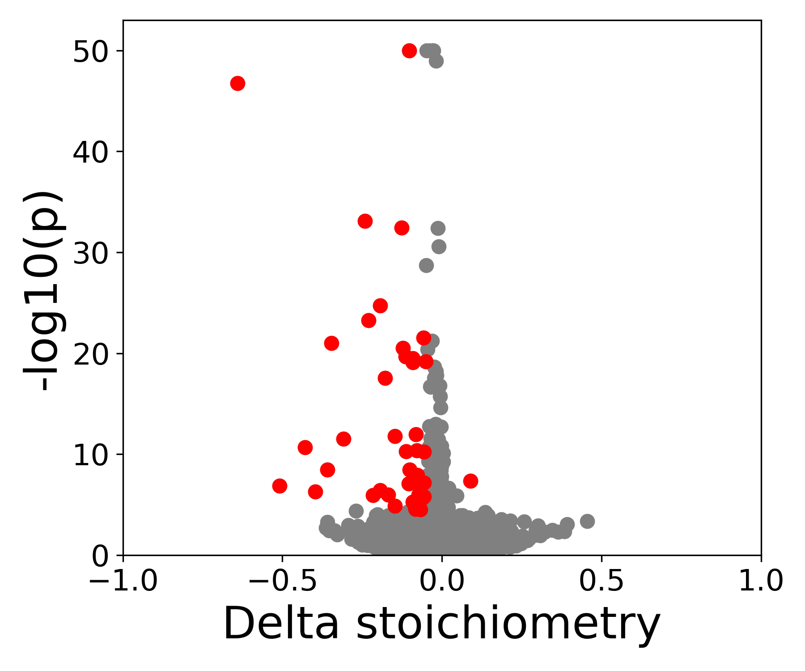

# Differential modification analysis

Identify reference sites with a significant difference in modification stoichiometry between conditions. 


## Running diff test

Use `SWARM_diff.py` to run GLM test and identify reference coordinates where stoichiometry depends on the condition.

```bash
python3 SWARM_diff.py -i $INPUT -o $OUT -n 24

```

```bash
Required:
  -i, --data_file            Tab-separated file with columns: M2_file_path RepName Condition
  -o, --output_file          Output file path

  Optional:
  -p, --M2_threshold         Only test sites where 1+ sample has site probability over p [0]
  -s, --Stoich_threshold     Only test sites where 1+ sample has stoichiometry over s [0]
  -delta, --Delta_threshold  BH adjust for sites over minimum delta stoichiometry [0]
  -n, --ncpus                Number of CPU threads [1]
  -h, --help                 Show this help message and exit
```

### Input format

Create an input file in tsv format, make sure to **include header** with 3 columns as seen below.  

```bash
M2_file_path    RepName Condition
/path/WT_rep1.m2.pred.tsv	1	WT
/path/WT_rep2.m2.pred.tsv	2	WT
/path/KO_rep1.m2.pred.tsv	1	KO
/path/KO_rep2.m2.pred.tsv	2	KO
```


1. M2_file_path:  path to the site-level prediction file (tsv)
2. RepName:       name of the rep, each sample of the same condition requires unique name
3. Condition:     reps will be grouped by condition, label the same condition consistently


### Output format

Produces a tsv file with p-values and average and per-rep information for sites tested with enough coverage in at least one sample. 

| contig | position | site     | coverage_KD | coverage_WT | probability_KD | probability_WT | stoichiometry_KD   | stoichiometry_WT | avg_stoichi_KD | avg_stoichi_WT | pval  | adj_pval |
|--------|----------|----------|-------------|-------------|----------------|----------------|--------------------|------------------|----------------|----------------|-------|----------|
| 1      | 52978277 | GGACA    | [ 0. 42.]   | [ 0. 50.]   | [nan, 0.047]   | [nan, 0.04]    | [0. 0.047]         | [0.   0.04]      | 0.048          | 0.040          | 0.859 | 1        |
| 1      | 52978282 | GGACT    | [23. 58.]   | [26. 75.]   | [0.043, 0.034] | [0.0, 0.04]    | [0.043 0.034]      | [0.   0.04]      | 0.037          | 0.030          | 0.801 | 1        |
| 1      | 52978287 | AGAAC    | [20. 50.]   | [22. 67.]   | [0.1, 0.04]    | [0.0, 0.074]   | [0.1  0.04]        | [0. 0.074]       | 0.057          | 0.056          | 0.981 | 1        |
| 1      | 52978295 | CCAGA    | [ 0. 52.]   | [23. 68.]   | [nan, 0.038]   | [0.217, 0.132] | [0. 0.038]         | [0.217  0.132]   | 0.038          | 0.154          | 0.152 | 1        |
| 1      | 52978297 | TTATC    | [21. 54.]   | [25. 69.]   | [0.142, 0.055] | [0.04, 0.028]  | [0.142 0.055]      | [0.04 0.0289]    | 0.080          | 0.032          | 0.261 | 1        |
| 1      | 52978305 | CTAGC    | [25. 57.]   | [25. 77.]   | [0.0, 0.052]   | [0.0, 0.118]   | [0. 0.052]         | [0.  0.116]      | 0.037          | 0.088          | 0.243 | 1        |
| 1      | 52978318 | GTACA    | [24. 52.]   | [21. 70.]   | [0.083, 0.173] | [0.047, 0.171] | [0.083 0.1732]     | [0.047 0.171]    | 0.145          | 0.143          | 0.975 | 1        |
| 1      | 52978321 | TGAAC    | [24. 54.]   | [23. 63.]   | [0.0, 0.037]   | [0.043, 0.031] | [0. 0.037]         | [0.043 0.031]    | 0.026          | 0.035          | 0.753 | 1        |
| 1      | 52978328 | ATAGG    | [22. 50.]   | [25. 69.]   | [0.045, 0.0]   | [0.0, 0.043]   | [0.045 0.        ] | [0. 0.043]       | 0.014          | 0.032          | 0.496 | 1        |
| 1      | 52978329 | GGAAC    | [22. 49.]   | [25. 70.]   | [0.045, 0.02]  | [0.0, 0.028]   | [0.045 0.02]       | [0. 0.028]       | 0.028          | 0.021          | 0.788 | 1        |

## Visualization


<!-- { width="400" style="display:block; margin:auto;"} -->
