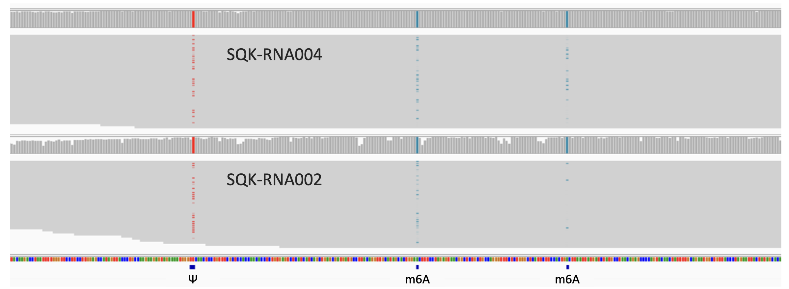

# SWARM user guide

Use SWARM to detect and analyse m6A, Ψ, and m5C from nanopore data. 

## Features

* ` SWARM_read_level.py` - Detect modifications at each base in individual reads.

* ` SWARM_site_level.py` - Measure modification status at reference coordinates.

* ` SWARM_diff.py` - Identify modified sites which vary between conditions.

## Required inputs

    .fasta file     # Reference transcriptome. *Genome alignment possible with workarounds.
    .blow5 file     # Contains easily accessible raw nanopore signals.
    .sam file       # Read alignments with event tags produced by f5c

User guide provides example code for generating the SWARM inputs from pod5/fast5 files. 
